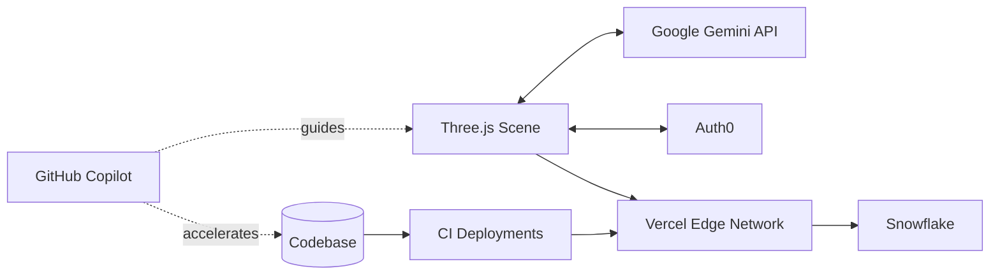

<!-- SolarXplorer Hero -->
<div align="center">
  
</div>

## 🌌 SolarXplorer — From Starlight to Spotlight

Team MetaVision set out to build a browser-native 3D solar system with Three.js. We began as two dreamers staring at a blank constellation of ideas and ended as a four-person crew launching a production-ready cosmic playground. This document traces that arc and captures how partner tools, open-source energy, and GitHub Copilot helped us land the mission.

### Mission Snapshot

| Scope | Details |
| --- | --- |
| Core Experience | Real-time, browser-based 3D solar system with interactive narration |
| Tech Stack | Three.js · WebGL · Vercel · Auth0 · Google Gemini API · Snowflake |
| Team | MetaVision (4 members: explorers, designers, optimizers, narrators) |
| Status | Public launch prototype complete; continuous content and performance tuning |

---
### Chapter 1 · Searching the Stars

> Once upon a code sprint, two of us set our sights on a 3D solar system that would feel effortless to explore. We had the vision, the drive, and the caffeine — but the build staggered under hosting limits and heavy assets. We needed more gravity in our orbit and two more teammates joined to balance pure creativity with optimization chops.

Key early hurdles:
- Planetary shaders that sprawled past budget on mid-range laptops
- Asset streaming hiccups during Vercel deployments
- Narration and guidance that felt flat without a proper assistant layer

---

### Chapter 2 · The Copilot Breakthrough

Hacktoberfest and the MLH Open Source Week changed our velocity. As we contributed upstream and compared notes with other makers, we discovered GitHub Copilot. The AI pair programmer became our guiding star:
- Refined noisy render loops into lean animation sequences
- Suggested lazy-loading strategies that unlocked smooth frame rates on “potato” hardware
- Surfaced deployment fixes that finally calmed Vercel’s timeouts

With Copilot steadied at the console, our biggest blockers collapsed and SolarXplorer finally rendered flawlessly across devices.

---

### Chapter 3 · Building the Galaxy

<div align="center">
  
</div>

We layered specialized partner tools from the MLH Hackerfest ecosystem to make the experience truly interstellar:

- 🚀 **Auth0** keeps explorers authenticated so progress, favorites, and achievements persist securely.
- 🪐 **Google Gemini API** acts as a personal guide; ask about planetary composition or history and receive contextual answers on the fly.
- ❄ **Snowflake** stores telemetry, user stories, and content updates, syncing insights back to the crew.
- 🤖 **GitHub Copilot** remains our cosmic co-pilot, translating frustration into momentum.

Feature highlights:
- Realistic orbital mechanics balanced for web performance
- Adaptive soundtrack and spatial audio cues for immersion
- Progressive enhancement that gracefully degrades on low-power devices
- Monitoring hooks that alert us to drift in frame times or API latency

---

### Architecture at a Glance



### Launch Timeline

```mermaid
timeline
  title SolarXplorer Flight Log
  section Conception
    Vision drafted :: 2024-Q1
    Core duo prototypes :: 2024-Q2
  section Expansion
    Team MetaVision formed :: 2024-Q3
    MLH Open Source Week :: 2024-Q3
  section Breakthrough
    GitHub Copilot onboarding :: 2024-Q4
    Performance stabilization :: 2025-Q1
  section Deployment
    Auth0 + Gemini integration :: 2025-Q2
    Snowflake analytics pipeline :: 2025-Q2
    Vercel production deploy :: 2025-Q3
```

---

### Mission Walkthrough

1. **Authenticate** — Sign in through Auth0 to sync mission progress and achievements.
2. **Launch** — Enter the Three.js solar system with an optimized loading sequence and easing transitions.
3. **Explore** — Glide between planets, toggle observatory mode, and ask Gemini for live context.
4. **Analyze** — Pull up Snowflake-backed dashboards for real-time mission data.
5. **Share** — Invite teammates, replay guided tours, and file improvement ideas via our open-source backlog.

---

### Team MetaVision

| Crew Member | Role | Superpower |
| --- | --- | --- |
| Vision Architect | Creative Direction | Turns gravity wells into cinematic experiences |
| Systems Navigator | WebGL Engineer | Tames shaders and frame budgets |
| Data Cartographer | Analytics Lead | Maps Snowflake insights to product calls |
| Story Weaver | UX Writer & Research | Keeps the narrative cohesive and human |

Together we bridge art, engineering, and storytelling. When workloads spike, Copilot jumps in as our fifth silent teammate, suggesting better abstractions, tighter loops, and smarter API choreography.

---

### Lessons from the Cosmos

- **Optimization is empathy.** If a galaxy doesn’t render on everyday laptops, the experience fails.
- **Open source fuels breakthroughs.** Community cycles surfaced patterns we never considered alone.
- **AI pair programming is leverage.** Copilot accelerated every refactor, deploy, and doc update.
- **Narrative matters.** Users stay longer when the system explains itself, so Gemini narrates every orbit.

---

### What’s Next

- Enrich Gemini’s knowledge base with new planetary stories and STEM lesson plans
- Expand multiplayer tours for classrooms and community events
- Introduce custom mission scripting so explorers can chart their own courses
- Publish optimization playbooks back to the open-source community that helped us lift off

---

<div align="center">
  
</div>

**SolarXplorer** is our declaration that high-end, accessible 3D experiences belong on the open web. From two curious builders to the full MetaVision crew, from starlight to spotlight — we launched a galaxy born from code, curiosity, and the partners who guided us. 🌠
