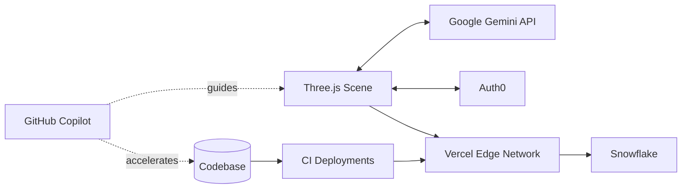
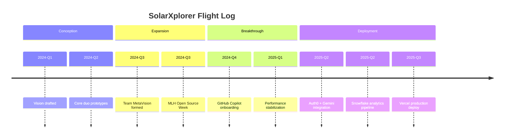

<!-- SolarXplorer Hero -->
<div align="center">
  
</div>

<div align="center">
  
</div>

<br>

```text
╔══════════════════════════════════════╗
║  Team ID: MetaVision                 ║
║  LOCATION: West Bengal, India        ║
║  INSTITUTION: GNIT                   ║
║  CLEARANCE: Level 30                 ║
║  DIVISION: Engineering               ║
║  STATUS: Active Development          ║
╚══════════════════════════════════════╝
   
🎯 MISSION OBJECTIVES:
   └─ Create a Hands-on Learning Platform
   └─ Deliver Lifetime Experience for Users
   └─ Make Open Source Hacking Memorable
```

## 🌌 SolarXplorer — From Starlight to Spotlight

**Team MetaVision** set out to build a browser-native 3D solar system with Three.js. We began as two dreamers staring at a blank constellation of ideas and evolved into a four-person crew launching a production-ready cosmic playground. This document traces that journey and captures how partner tools, open-source collaboration, and GitHub Copilot helped us achieve our mission.

### Mission Snapshot

| Scope | Details |
| --- | --- |
| Core Experience | Real-time, browser-based 3D solar system with interactive narration |
| Tech Stack | Three.js · WebGL · Vercel · Auth0 · Google Gemini API · Snowflake |
| Team | MetaVision (4 members: explorers, designers, optimizers, narrators) |
| Status | Public launch prototype complete; continuous content and performance tuning |

---
### Our Story • From Vision to Execution

Our journey began with a simple yet ambitious goal: build a 3D solar system in Three.js that runs seamlessly in any browser. The founding duo of Team MetaVision spent countless late nights sketching orbital mechanics, fine-tuning shaders, and dreaming of an experience that would feel cinematic on any device. As our vision expanded, so did our crew—four passionate teammates united by curiosity, caffeine, and an unwavering desire to prove that high-end 3D experiences belong on the open web.

In the early stages, we faced significant challenges with optimization, deployment, and hosting. Despite multiple rebuilds, we couldn't achieve the smooth performance we envisioned across different devices—from high-end laptops to modest smartphones. Asset payloads ballooned, frame rates plummeted, and every Vercel deployment felt like rolling dice.

<div align="center">
  
</div>

We kept iterating—profiling frame drops, pruning textures, and revisiting our render pipeline. The prototype captured the atmosphere we wanted, but the dream of a buttery-smooth solar system still felt an arm’s length away.

<div align="center">
  
</div>

The breakthrough came during our participation in MLH Open Source Week and Hacktoberfest. Contributing to projects worldwide sharpened our development instincts and introduced us to the missing piece of our workflow: **GitHub Copilot**. With Copilot as our AI pair programmer, we systematically refactored heavy render loops, implemented intelligent lazy-loading strategies, and finally delivered builds that remained responsive even on modest hardware. Vercel deployments transformed from anxiety-inducing gambles into predictable, reliable processes.

<div align="center">
  
</div>

To enhance the user experience, we integrated powerful partner tools from the MLH ecosystem:

- 🚀 **Auth0** — Provides enterprise-grade authentication, enabling explorers to save their cosmic journeys and unlock achievements
- 🪐 **Google Gemini API** — Functions as an intelligent "Solar System Guide," delivering contextual answers as users navigate between celestial bodies  
- ❄️ **Snowflake** — Manages our mission analytics with lightning-fast data processing behind the scenes
- 🤖 **GitHub Copilot** — Continuously accelerates our development velocity while maintaining code quality during rapid iteration

<div align="center">
  
</div>

Today, **SolarXplorer** invites anyone to embark on an optimized, immersive journey through our solar system—featuring fluid graphics, scientifically accurate planetary motion, and ambient interstellar soundscapes. More than just code, it’s the story of how teamwork, open source learning, and modern developer tools transformed ambition into reality.

### ✨ Feature Highlights

<div align="center">
  
  
  
  
  
</div>

- **Real-time Orbital Mechanics** — Browser-optimized celestial choreography with accurate physics simulation
- **Adaptive Performance** — Dynamic visual settings that maintain smooth frame rates across all device capabilities  
- **AI-Powered Narration** — Context-aware storytelling powered by Gemini's intelligent, on-demand insights
- **Immersive Audio-Visual Design** — Progressive lighting and sound cues that enhance the cosmic sense of scale
- **Interactive Learning Pathways** — Educational journeys that make space science and planetary mythology tangible and engaging

### 🎓 Educational Mission

**SolarXplorer** is built as an educational constellation as much as an entertainment showcase. Every orbit, tooltip, and AI-guided prompt is crafted to help explorers learn about the physics of our solar system, the myths that shaped planetary names, and the frontier missions pushing humanity deeper into space. From classroom demonstrations to self-guided stargazing sessions, the experience sparks curiosity that extends far beyond the digital realm.

### 🌟 Constellation Moments (Hover-Worthy Highlights)


<div align="center">
  
</div>

- **Aurora Trails:** Dynamic particle wakes shimmer behind orbiting bodies, pulsing in sync with the soundtrack so every flyby feels alive.
- **Nebula Mode:** A cinematic camera sweep that bathes planets in volumetric light, complete with lens flares tuned for responsive performance.
- **Stellar Portals:** Contextual Gemini prompts open side-by-side overlays, letting explorers query lore without ever leaving the cosmos.
- **Meteor Showers on Demand:** Easter eggs trigger procedurally generated meteor arcs, ideal for live demos and late-night wow-moments.

> “We wanted moments that make viewers reach for the trackpad just to see what happens next. These flourishes are why SolarXplorer feels enchanted rather than engineered.” — Team MetaVision

We are Team MetaVision, and SolarXplorer is proof that curiosity, collaboration, and the right copilots can launch a galaxy.

---

### Architecture at a Glance



### Launch Timeline



---

### Mission Walkthrough

1. **Authenticate** — Sign in through Auth0 to sync mission progress and achievements.
2. **Launch** — Enter the Three.js solar system with an optimized loading sequence and easing transitions.
3. **Explore** — Glide between planets, toggle observatory mode, and ask Gemini for live context.
4. **Analyze** — Pull up Snowflake-backed dashboards for real-time mission data.
5. **Share** — Invite teammates, replay guided tours, and file improvement ideas via our open-source backlog.

---

### 👥 Team MetaVision

| Crew Member | Role | Superpower |
| --- | --- | --- |
| **Vision Architect** | Creative Direction | Transforms gravity wells into cinematic experiences |
| **Systems Navigator** | WebGL Engineer | Masters shaders and optimizes frame budgets |
| **Data Cartographer** | Analytics Lead | Maps Snowflake insights to strategic product decisions |
| **Story Weaver** | UX Writer & Research | Maintains narrative cohesion and human-centered design |

Together, we bridge the realms of art, engineering, and storytelling. During intensive development phases, **GitHub Copilot** serves as our fifth silent teammate, suggesting refined abstractions, optimized algorithms, and elegant API choreography that elevates our collective output.

---

### 💡 Lessons from the Cosmos

- **Optimization is empathy** — If our galaxy can't render smoothly on everyday laptops, we've failed our users
- **Open source fuels innovation** — Community collaboration revealed optimization patterns we never would have discovered in isolation  
- **AI pair programming amplifies potential** — Copilot accelerated every refactoring session, deployment process, and documentation update
- **Narrative enhances engagement** — Users invest more time when the system tells compelling stories, which is why Gemini narrates every orbital journey

---

### 🚀 What's Next

- **Enhanced AI Learning** — Expand Gemini's knowledge base with advanced planetary stories and comprehensive STEM curricula
- **Collaborative Exploration** — Develop multiplayer tour capabilities for classroom integration and community events  
- **Custom Mission Framework** — Implement user-scriptable missions enabling explorers to design their own cosmic adventures
- **Open Source Contributions** — Publish performance optimization playbooks to give back to the community that empowered our success

---

<div align="center">
  
</div>

**SolarXplorer** is our declaration that high-end, accessible 3D experiences belong on the open web. From two curious builders to the full MetaVision crew, from starlight to spotlight — we launched a galaxy born from code, curiosity, and the partners who guided us. 🌠

<div align="center">
  
</div>
