# SolarXplorer 🌌

<div align="center">
  
</div>

<div align="center">
  
</div>

<div align="center">
  
[](https://solarXplorer.vercel.app)
[](https://threejs.org/)
[](https://auth0.com/)
[](https://github.com/features/copilot)
[](https://vercel.com)

</div>

<br>

```text
╔═══════════════════════════════════════════════════════════╗
║  🎮 TEAM ID: MetaVision                                   ║
║  📍 LOCATION: West Bengal, India | GNIT                   ║
║  🚀 MISSION: Make Space Education Unforgettable           ║
║  ⚡ STATUS: LIVE & Ready for Cosmic Adventures            ║
╚═══════════════════════════════════════════════════════════╝
```

<div align="center">
  
</div>

---

## 🌟 What Is This Cosmic Magic?

Ever wanted to **fly through the solar system** without leaving your couch? SolarXplorer is a fully interactive, browser-based 3D universe where you can:

<div align="center">

🪐 **Orbit planets in real-time** | 🎨 **Experience cinematic visual effects** | 🤖 **Chat with an AI space guide**

</div>

No downloads. No installations. Just pure **WebGL-powered** space exploration that runs on anything from your gaming rig to your phone! 

<div align="center">
  
</div>

---

## ✨ Features That'll Blow Your Mind

<table>
<tr>
<td width="50%">

### 🎯 Real-Time Orbital Physics
Watch planets dance around the Sun with scientifically accurate mechanics. We didn't just fake it—we calculated it!


</td>
<td width="50%">

### 🌈 Aurora Trails & Visual Magic
Dynamic particle effects that make every orbit feel **alive**. Think lightsabers, but for planets!


</td>
</tr>
<tr>
<td width="50%">

### 🤖 AI-Powered Space Guide
Ask **Google Gemini** anything! "Why is Mars red?" "How hot is Venus?" Get instant cosmic knowledge.


</td>
<td width="50%">

### 📱 Works Everywhere
Desktop? Laptop? Phone? Tablet? Smart fridge? (Okay, maybe not that last one... yet.)


</td>
</tr>
</table>

<div align="center">
  
  
  
</div>

---

## 🌠 Special Effects Arsenal

<div align="center">
  
</div>

### 💫 Nebula Mode
Cinematic camera sweeps with volumetric lighting that'll make you feel like you're in Interstellar!

### ☄️ Meteor Showers on Demand
Click a secret button and watch procedurally generated meteors streak across your screen. Perfect for impressing your friends!

### 🌌 Stellar Portals
Side-by-side AI overlays that don't interrupt your cosmic journey. Ask questions without leaving orbit!

### 🎵 Spatial Audio
Close your eyes and **hear** the solar system. Each planet has its own ambient soundscape!

<div align="center">
  
> *"We wanted moments that make viewers reach for the trackpad just to see what happens next. These flourishes are why SolarXplorer feels enchanted rather than engineered."*  
> — Team MetaVision ✨

</div>

---

## 🚀 Quick Start — Blast Off in 30 Seconds!

<div align="center">
  
</div>

### Option 1: Just Click & Explore! 🖱️
**[👉 LAUNCH SOLARXPLORER NOW 👈](https://solarXplorer.vercel.app)**

### Option 2: Run It Locally 💻
```bash
# Clone this cosmic repository
git clone https://github.com/Dronzer2code/solarXplorer.git

# Jump into the cockpit
cd solarXplorer

# Install the fuel (dependencies)
npm install

# IGNITION! 🔥
npm run dev
```

<div align="center">
  
</div>

---

## 🎮 How to Play... Er, Explore!

<table>
<tr>
<td width="33%" align="center">

### 1️⃣ Sign In


**Auth0** magic lets you save progress & unlock achievements!

</td>
<td width="33%" align="center">

### 2️⃣ Navigate


Use your mouse/trackpad to fly between planets. It's intuitive!

</td>
<td width="33%" align="center">

### 3️⃣ Learn


Ask **Gemini** anything about space. Get mind-blown! 🤯

</td>
</tr>
</table>

---

## 🛠️ Built With Rocket Science

<div align="center">


</div>

### 🎨 The Magic Ingredients

<details>
<summary><b>🔥 Core Technologies (Click to expand!)</b></summary>

- **Three.js** — The legendary 3D engine that powers our cosmos
- **Custom Physics Engine** — We literally coded Kepler's laws into JavaScript
- **Web Audio API** — Spatial sound that makes space feel HUGE
- **WebGL** — GPU-accelerated graphics go brrrr 🚀

</details>

<details>
<summary><b>🔗 Partner Superpowers</b></summary>

| Partner | What It Does | Why It's Awesome |
|---------|--------------|------------------|
| 🔐 **Auth0** | User authentication | Save your progress across devices! |
| 🤖 **Gemini** | AI space guide | Ask anything, get smart answers |
| ❄️ **Snowflake** | Analytics engine | We track which planets are most popular |
| 💻 **Copilot** | AI pair programmer | Helped us code 3x faster |
| ⚡ **Vercel** | Blazing-fast hosting | Global CDN = speed of light delivery |

</details>

<details>
<summary><b>🛠️ Developer Tools</b></summary>

- **Vite** — Lightning-fast build system
- **ESLint & Prettier** — Keeps our code clean
- **GitHub Actions** — Automated deployments
- **Chrome DevTools** — For when things inevitably break 😅

</details>

---

## 📖 Our Epic Journey — From 2 Devs to Production

<div align="center">
  
</div>

### 🌱 The Beginning (2024 Q1-Q2)
Two dreamers with a crazy idea: *"What if we built a solar system... in a browser?"*

**The Problem:** Our prototype was beautiful but **slooooow**. Frame rates dropped, deployments failed, and we questioned our life choices daily.

<div align="center">
  
  <br>
  <i>☝️ Our early prototype — pretty but choppy</i>
</div>

### 🚀 The Breakthrough (2024 Q3-Q4)

We joined **MLH Open Source Week** and **Hacktoberfest**. Best. Decision. Ever.

<div align="center">
  
</div>

**The Game-Changer:** We discovered **GitHub Copilot** and it became our fifth team member! 

✅ Refactored heavy render loops  
✅ Implemented smart lazy-loading  
✅ Optimized for potato phones and gaming PCs alike  
✅ Made Vercel deployments predictable  

<div align="center">
  
  <br>
  <i>☝️ After optimization — buttery smooth!</i>
</div>

### 🌟 Launch Day (2025)

**Team MetaVision** (now 4 strong!) shipped a production-ready solar system that works on ANY device!

<div align="center">
  
  <br>
  <b>WE DID IT! 🎉</b>
</div>

---

## 🏗️ Architecture (For the Nerds)

```mermaid
flowchart LR
    Browser[🌍 Your Browser<br/>Three.js Magic]
    Gemini[🤖 Google Gemini<br/>AI Brain]
    Auth0[🔐 Auth0<br/>Login System]
    Vercel[⚡ Vercel Edge<br/>Super Fast Hosting]
    Snowflake[❄️ Snowflake<br/>Analytics]
    Copilot[💻 GitHub Copilot<br/>AI Coding Partner]
    
    Browser<-->Gemini
    Browser<-->Auth0
    Browser-->Vercel
    Vercel-->Snowflake
    Copilot-. helped build .->Browser
    
    style Browser fill:#FF6B6B
    style Gemini fill:#4ECDC4
    style Auth0 fill:#EB5424
    style Vercel fill:#000000
    style Snowflake fill:#29B5E8
    style Copilot fill:#00FF9C
```



---

## 👥 Meet Team MetaVision

<div align="center">
  
</div>

We're a crew of **4 space-obsessed developers** from GNIT, West Bengal, India who decided to make education awesome!

| Role | Superpower | Favorite Planet |
|------|-----------|-----------------|
| 🎨 **Vision Architect** | Makes gravity wells look cinematic | Saturn (those rings!) |
| ⚙️ **Systems Navigator** | WebGL optimization wizard | Jupiter (it's HUGE) |
| 📊 **Data Cartographer** | Snowflake analytics guru | Earth (we live here) |
| ✍️ **Story Weaver** | Crafts the narrative magic | Mars (future home?) |

Plus our **silent 5th member**: GitHub Copilot! 🤖

---

## 💡 What We Learned

<div align="center">
  
</div>

### 🎯 Optimization = Love
If your app lags on a budget laptop, you're gatekeeping. We made SolarXplorer run on EVERYTHING.

### 🌍 Open Source = Superpowers
Hacktoberfest taught us more in 2 weeks than 6 months of solo coding.

### 🤖 AI Coding Partners = 3x Speed
Copilot didn't replace us—it made us BETTER. Faster iterations, cleaner code, more time for creativity.

### 📖 Story > Specs
People don't care about your tech stack. They care about the EXPERIENCE. Tell a story!

---

## 🗺️ What's Next — Our Roadmap to the Stars

<div align="center">
  
</div>

- [ ] 🎓 **Expanded AI Tutor** — More space facts, better explanations, homework help!
- [ ] 👥 **Multiplayer Mode** — Explore with friends in real-time
- [ ] 🎮 **Mission Creator** — Build your own space adventures
- [ ] 📱 **Native Apps** — iOS & Android versions
- [ ] 🥽 **VR Support** — Because why not?
- [ ] 🌌 **Beyond Solar System** — Let's visit other star systems!
- [ ] 📚 **Open Source Playbook** — Share our optimization secrets

---

## 🤝 Want to Contribute?

<div align="center">
  
</div>

**YES! We'd love your help!** 

Whether you're a:
- 🎨 **Designer** — Make it prettier!
- 💻 **Developer** — Add features, fix bugs
- 📝 **Writer** — Improve docs, add planet facts
- 🧪 **Tester** — Find bugs on weird devices
- 🎓 **Educator** — Suggest learning improvements

### How to Join the Crew

1. **Fork** this repo 🍴
2. **Create** a branch (`git checkout -b feature/AmazingFeature`)
3. **Commit** your magic (`git commit -m 'Add some AmazingFeature'`)
4. **Push** to space (`git push origin feature/AmazingFeature`)
5. **Open** a Pull Request 🚀

Check out [CONTRIBUTING.md](CONTRIBUTING.md) for detailed guidelines!

---

## 🎓 Perfect For

✅ **Teachers** — Make astronomy class unforgettable  
✅ **Students** — Study the solar system interactively  
✅ **Space Nerds** — Explore at your own pace  
✅ **Developers** — Learn Three.js from a real project  
✅ **Parents** — Educational screen time that's actually fun  

<div align="center">
  
</div>

---

## 📜 License

MIT License — Use it, fork it, improve it! Just keep it open source ❤️

---

## 🙏 Massive Thanks To

<div align="center">

**🎉 MLH** — For Open Source Week & Hacktoberfest  
**🔐 Auth0** — Enterprise-grade auth made simple  
**🤖 Google** — Gemini API for AI narration  
**❄️ Snowflake** — Lightning-fast analytics  
**💻 GitHub** — Copilot changed our lives  
**🌐 Vercel** — Deployment that just works  
**🎨 Three.js Community** — Standing on the shoulders of giants  

</div>

---

## 📞 Connect With Us!

<div align="center">

[](https://github.com/Dronzer2code)
[](https://github.com/Dronzer2code/solarXplorer)
[](https://solarXplorer.vercel.app)

**Questions? Ideas? Just want to say hi?** Open an issue or reach out!

</div>

---

<div align="center">
  
  
  ### 🌟 If You Like This Project, Give It a Star! 🌟
  
  **Made with ❤️, ☕, and a whole lot of debugging by Team MetaVision**
  
  
</div>

---

<div align="center">
  
*"We are all in the gutter, but some of us are looking at the stars."* — Oscar Wilde

**Now you can do both with SolarXplorer! 🚀✨**

</div>
