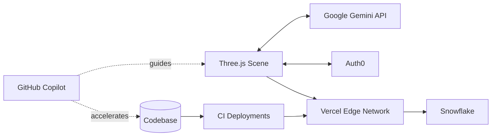
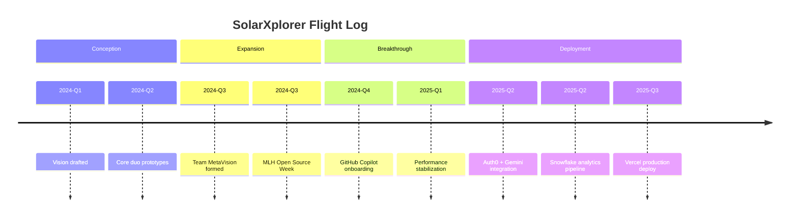

<!-- SolarXplorer Hero -->
<div align="center">
  
</div>

<div align="center">
  
</div>

```text
╔══════════════════════════════════════╗
║  Team ID: MetaVision                ║
║  LOCATION: West Bengal,India      ║
║  INSTITUTION: GNIT                   ║
║  CLEARANCE: Level 30                  ║
║  DIVISION: Enginnering          ║
║  STATUS: Active Development          ║
╚══════════════════════════════════════╝
   
🎯 MISSION OBJECTIVE:
   └─ Create a Hand on Learning Platform
   └─ Giveing Lifetime Experience for users
   └─ Make Open Source hacking Memorable
```

## 🌌 SolarXplorer — From Starlight to Spotlight

Team MetaVision set out to build a browser-native 3D solar system with Three.js. We began as two dreamers staring at a blank constellation of ideas and ended as a four-person crew launching a production-ready cosmic playground. This document traces that arc and captures how partner tools, open-source energy, and GitHub Copilot helped us land the mission.

### Mission Snapshot

| Scope | Details |
| --- | --- |
| Core Experience | Real-time, browser-based 3D solar system with interactive narration |
| Tech Stack | Three.js · WebGL · Vercel · Auth0 · Google Gemini API · Snowflake |
| Team | MetaVision (4 members: explorers, designers, optimizers, narrators) |
| Status | Public launch prototype complete; continuous content and performance tuning |

---
### Our Story · From Vision to Execution

Our journey began with a simple goal: build a 3D solar system in Three.js that runs directly in the browser. The founding duo of Team MetaVision spent late nights sketching orbits, tweaking shaders, and dreaming of an experience that felt cinematic on any device. As the vision grew, so did the crew—four teammates united by curiosity, caffeine, and a desire to prove that high-end 3D belongs on the open web.

In the early stages we struggled with optimization, deployment, and hosting. Despite multiple rebuilds, we could not get SolarXplorer to glide smoothly across laptops and phones. Asset payloads spiked, performance tanked, and every Vercel deploy felt like a coin flip.

<div align="center">
  
</div>

We kept iterating—profiling frame drops, pruning textures, and revisiting our render pipeline. The prototype captured the atmosphere we wanted, but the dream of a buttery-smooth solar system still felt an arm’s length away.

<div align="center">
  
</div>

Momentum arrived during our first MLH Open Source Week and Hacktoberfest. Contributing to projects around the globe sharpened our instincts—and introduced us to the missing link in our workflow: **GitHub Copilot**. With Copilot pairing alongside us, we refactored heavy render loops, implemented smarter lazy-loading, and finally shipped builds that felt responsive even on low-spec hardware. Deployments to Vercel stopped feeling like roulette and started feeling routine.

<div align="center">
  
</div>

To amplify the experience, we layered in partner tools from the MLH Hackerfest ecosystem:

- 🚀 **Auth0** delivers reliable, secure authentication so explorers can save journeys and achievements.
- 🪐 **Google Gemini API** acts as a virtual “Solar System Guide,” answering questions as users glide between planets.
- ❄️ **Snowflake** keeps our mission data organized and lightning-fast behind the scenes.
- 🤖 **GitHub Copilot** continues to accelerate development, helping us maintain quality while we experiment.

<div align="center">
  
</div>

Today SolarXplorer invites anyone to embark on an optimized, immersive journey through space—complete with smooth graphics, realistic planetary motion, and ambient interstellar sound. More than just code, it’s the story of how teamwork, open source learning, and modern developer tools transformed ambition into reality.

Feature highlights:
- Real-time orbital choreography designed for the browser
- Adaptive visual settings that keep frame rates steady on “potato” hardware
- Context-aware narration powered by Gemini’s on-demand insights
- Progressive audio and lighting cues that deepen the sense of scale
- Interactive educational journeys that make space science and planetary lore feel tangible

SolarXplorer is built as an educational constellation as much as an entertainment showcase. Every orbit, tooltip, and AI-guided prompt is crafted to help explorers learn about the physics of our solar system, the myths that shaped planetary names, and the frontier missions pushing humanity deeper into space. From classroom demos to self-guided stargazing, the experience sparks curiosity well beyond the screen.

### Constellation Moments (Hover-Worthy Highlights)

<div align="center">
  
</div>

- **Aurora Trails:** Dynamic particle wakes shimmer behind orbiting bodies, pulsing in sync with the soundtrack so every flyby feels alive.
- **Nebula Mode:** A cinematic camera sweep that bathes planets in volumetric light, complete with lens flares tuned for responsive performance.
- **Stellar Portals:** Contextual Gemini prompts open side-by-side overlays, letting explorers query lore without ever leaving the cosmos.
- **Meteor Showers on Demand:** Easter eggs trigger procedurally generated meteor arcs, ideal for live demos and late-night wow-moments.

> “We wanted moments that make viewers reach for the trackpad just to see what happens next. These flourishes are why SolarXplorer feels enchanted rather than engineered.” — Team MetaVision

We are Team MetaVision, and SolarXplorer is proof that curiosity, collaboration, and the right copilots can launch a galaxy.

---

### Architecture at a Glance



### Launch Timeline



---

### Mission Walkthrough

1. **Authenticate** — Sign in through Auth0 to sync mission progress and achievements.
2. **Launch** — Enter the Three.js solar system with an optimized loading sequence and easing transitions.
3. **Explore** — Glide between planets, toggle observatory mode, and ask Gemini for live context.
4. **Analyze** — Pull up Snowflake-backed dashboards for real-time mission data.
5. **Share** — Invite teammates, replay guided tours, and file improvement ideas via our open-source backlog.

---

### Team MetaVision

| Crew Member | Role | Superpower |
| --- | --- | --- |
| Vision Architect | Creative Direction | Turns gravity wells into cinematic experiences |
| Systems Navigator | WebGL Engineer | Tames shaders and frame budgets |
| Data Cartographer | Analytics Lead | Maps Snowflake insights to product calls |
| Story Weaver | UX Writer & Research | Keeps the narrative cohesive and human |

Together we bridge art, engineering, and storytelling. When workloads spike, Copilot jumps in as our fifth silent teammate, suggesting better abstractions, tighter loops, and smarter API choreography.

---

### Lessons from the Cosmos

- **Optimization is empathy.** If a galaxy doesn’t render on everyday laptops, the experience fails.
- **Open source fuels breakthroughs.** Community cycles surfaced patterns we never considered alone.
- **AI pair programming is leverage.** Copilot accelerated every refactor, deploy, and doc update.
- **Narrative matters.** Users stay longer when the system explains itself, so Gemini narrates every orbit.

---

### What’s Next

- Enrich Gemini’s knowledge base with new planetary stories and STEM lesson plans
- Expand multiplayer tours for classrooms and community events
- Introduce custom mission scripting so explorers can chart their own courses
- Publish optimization playbooks back to the open-source community that helped us lift off

---

<div align="center">
  
</div>

**SolarXplorer** is our declaration that high-end, accessible 3D experiences belong on the open web. From two curious builders to the full MetaVision crew, from starlight to spotlight — we launched a galaxy born from code, curiosity, and the partners who guided us. 🌠
